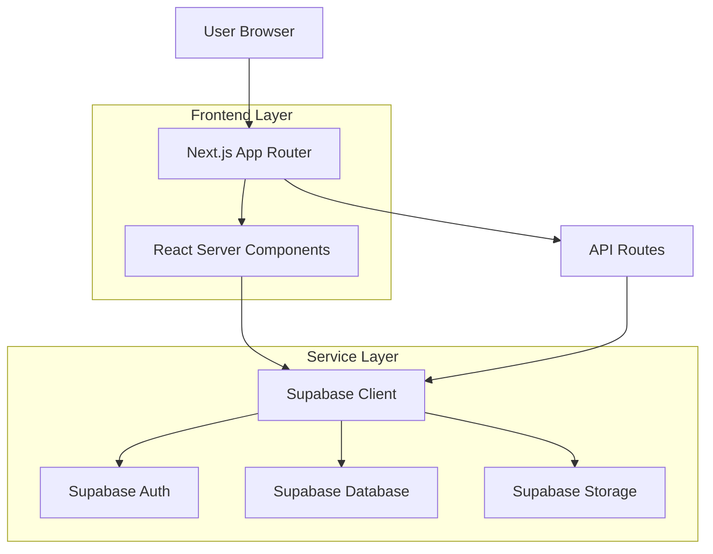
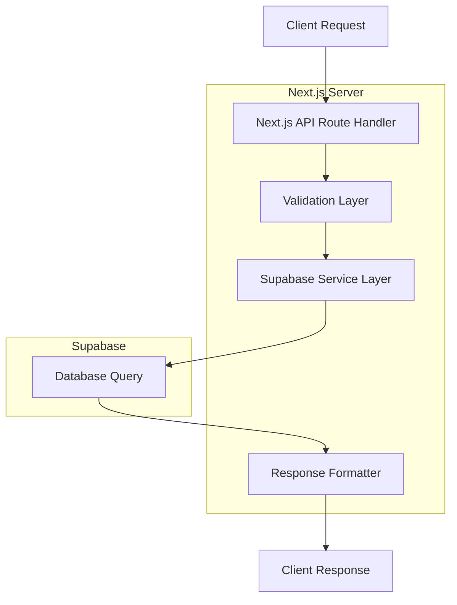
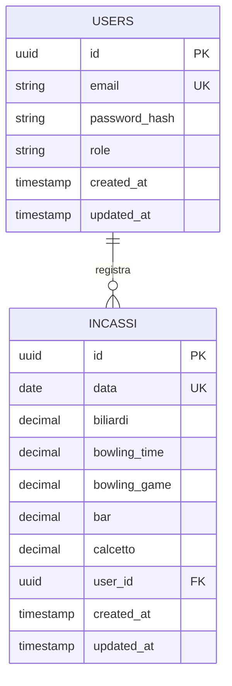

## 1. Architecture Design



## 2. Technology Description

* **Frontend**: Next.js 14 (App Router) + React Server Components + TypeScript

* **Styling**: TailwindCSS + Shadcn/UI components

* **Charts**: Recharts per visualizzazioni dati

* **Database**: Supabase (PostgreSQL)

* **Authentication**: Supabase Auth

* **Initialization Tool**: create-next-app

## 3. Route Definitions

| Route          | Purpose                                         |
| -------------- | ----------------------------------------------- |
| /              | Dashboard principale con overview KPI e grafici |
| /inserimento   | Form per inserimento/modifica dati giornalieri  |
| /comparazione  | Sezione comparazione tra due periodi            |
| /login         | Pagina autenticazione utente                    |
| /api/incassi   | API per CRUD operazioni sui dati incassi        |
| /api/confronto | API per comparazione tra periodi                |
| /api/auth/\*   | Route per gestione autenticazione Supabase      |

## 4. API Definitions

### 4.1 Core API

**Inserimento/Modifica Dati Incassi**

```
POST /api/incassi
```

Request:

| Param Name    | Param Type | isRequired | Description                       |
| ------------- | ---------- | ---------- | --------------------------------- |
| data          | string     | true       | Data nel formato ISO (YYYY-MM-DD) |
| biliardi      | number     | false      | Incasso biliardi (può essere 0)   |
| bowling\_time | number     | false      | Incasso bowling time              |
| bowling\_game | number     | false      | Incasso bowling game              |
| bar           | number     | false      | Incasso bar                       |
| calcetto      | number     | false      | Incasso calcetto                  |

Response:

| Param Name | Param Type | Description                  |
| ---------- | ---------- | ---------------------------- |
| success    | boolean    | Stato operazione             |
| message    | string     | Messaggio di conferma/errore |
| data       | object     | Dati salvati con ID          |

**Recupero Dati Filtrati**

```
GET /api/incassi
```

Query Parameters:

| Param Name | Param Type | isRequired | Description                                       |
| ---------- | ---------- | ---------- | ------------------------------------------------- |
| startDate  | string     | false      | Data inizio formato ISO                           |
| endDate    | string     | false      | Data fine formato ISO                             |
| categories | string\[]  | false      | Array categorie da filtrare                       |
| period     | string     | false      | Preimpostazioni: 'today', 'week', 'month', 'year' |

**Comparazione Periodi**

```
GET /api/confronto
```

Query Parameters:

| Param Name   | Param Type | isRequired | Description      |
| ------------ | ---------- | ---------- | ---------------- |
| periodAStart | string     | true       | Inizio periodo A |
| periodAEnd   | string     | true       | Fine periodo A   |
| periodBStart | string     | true       | Inizio periodo B |
| periodBEnd   | string     | true       | Fine periodo B   |

## 5. Server Architecture Diagram



## 6. Data Model

### 6.1 Data Model Definition



### 6.2 Data Definition Language

**Tabella Utenti (users)**

```sql
-- create table
CREATE TABLE users (
    id UUID PRIMARY KEY DEFAULT gen_random_uuid(),
    email VARCHAR(255) UNIQUE NOT NULL,
    password_hash VARCHAR(255) NOT NULL,
    role VARCHAR(20) DEFAULT 'standard' CHECK (role IN ('admin', 'standard')),
    created_at TIMESTAMP WITH TIME ZONE DEFAULT NOW(),
    updated_at TIMESTAMP WITH TIME ZONE DEFAULT NOW()
);

-- create index
CREATE INDEX idx_users_email ON users(email);
CREATE INDEX idx_users_role ON users(role);
```

**Tabella Incassi (incassi)**

```sql
-- create table
CREATE TABLE incassi (
    id UUID PRIMARY KEY DEFAULT gen_random_uuid(),
    data DATE NOT NULL,
    biliardi DECIMAL(10,2) DEFAULT 0.00,
    bowling_time DECIMAL(10,2) DEFAULT 0.00,
    bowling_game DECIMAL(10,2) DEFAULT 0.00,
    bar DECIMAL(10,2) DEFAULT 0.00,
    calcetto DECIMAL(10,2) DEFAULT 0.00,
    user_id UUID REFERENCES users(id),
    created_at TIMESTAMP WITH TIME ZONE DEFAULT NOW(),
    updated_at TIMESTAMP WITH TIME ZONE DEFAULT NOW(),
    UNIQUE(data)
);

-- create index
CREATE INDEX idx_incassi_data ON incassi(data);
CREATE INDEX idx_incassi_data_range ON incassi(data DESC);
CREATE INDEX idx_incassi_user_id ON incassi(user_id);

-- Supabase RLS Policies
ALTER TABLE incassi ENABLE ROW LEVEL SECURITY;

-- Allow read access to all authenticated users
CREATE POLICY "Allow read access" ON incassi
    FOR SELECT USING (auth.role() = 'authenticated');

-- Allow insert/update only for admin users
CREATE POLICY "Allow insert for admin" ON incassi
    FOR INSERT WITH CHECK (auth.role() = 'authenticated' AND EXISTS (
        SELECT 1 FROM users WHERE id = auth.uid() AND role = 'admin'
    ));

CREATE POLICY "Allow update for admin" ON incassi
    FOR UPDATE USING (auth.role() = 'authenticated' AND EXISTS (
        SELECT 1 FROM users WHERE id = auth.uid() AND role = 'admin'
    ));

-- Grant permissions
GRANT SELECT ON incassi TO authenticated;
GRANT INSERT, UPDATE ON incassi TO authenticated;
```

**Dati Iniziali di Esempio**

```sql
-- Inserimento dati test
INSERT INTO incassi (data, biliardi, bowling_time, bowling_game, bar, calcetto) VALUES
('2025-12-01', 450.00, 320.00, 280.00, 680.00, 350.00),
('2025-12-02', 380.00, 290.00, 310.00, 720.00, 420.00),
('2025-12-03', 520.00, 340.00, 250.00, 650.00, 380.00),
('2025-12-04', 480.00, 380.00, 290.00, 710.00, 450.00),
('2025-12-05', 550.00, 420.00, 340.00, 800.00, 520.00),
('2025-12-06', 420.00, 350.00, 280.00, 690.00, 390.00),
('2025-12-07', 600.00, 480.00, 380.00, 850.00, 580.00);
```

## 7. Component Architecture

### 7.1 Struttura Cartelle

```
app/
├── dashboard/
│   ├── page.tsx              # Dashboard principale
│   └── comparazione/
│       └── page.tsx          # Pagina comparazione periodi
├── inserimento/
│   └── page.tsx              # Form inserimento dati
├── api/
│   ├── incassi/
│   │   ├── route.ts          # GET/POST incassi
│   │   └── [id]/
│   │       └── route.ts      # PUT/DELETE singolo record
│   └── confronto/
│       └── route.ts          # GET comparazione periodi
├── components/
│   ├── charts/
│   │   ├── LineChart.tsx     # Grafico andamento temporale
│   │   ├── BarChart.tsx      # Grafico barre attività
│   │   ├── PieChart.tsx      # Grafico torta categorie
│   │   └── ComparisonChart.tsx # Grafico comparativo
│   ├── ui/
│   │   ├── KPICard.tsx       # Card KPI animata
│   │   ├── DateFilter.tsx    # Filtri data avanzati
│   │   ├── CategoryFilter.tsx # Filtri categoria
│   │   └── DataForm.tsx      # Form inserimento dati
│   └── layout/
│       ├── Sidebar.tsx       # Sidebar navigation
│       └── Header.tsx        # Top bar con filtri
├── lib/
│   ├── supabase.ts           # Client Supabase
│   ├── types.ts              # TypeScript definitions
│   └── utils.ts              # Utility functions
└── middleware.ts             # Auth middleware
```

### 7.2 Key Components

**Dashboard Layout**

* Sidebar collapsibile con navigation menu

* Top bar con filtri globali e user menu

* Grid layout responsive per cards e grafici

* Dark/light mode toggle

**Chart Components**

* Server components per fetching dati

* Client components per interattività

* Responsive design per tutti i breakpoint

* Animazioni smooth su transizioni dati

**Filter System**

* Global state management per filtri

* URL sync per condivisione filtri

* Debounced updates per performance

* Preset rapidi accessibili

